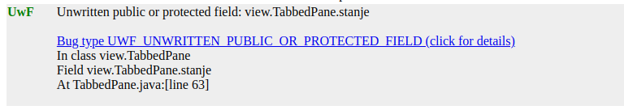

### Analiza Projekta: Studentska Služba

**Uvod**

Projekat koji je predmet ove analize predstavlja Java aplikaciju razvijenu za potrebe korišćenja studentske službe. Aplikacija je implementirana uz pomoć programskog jezika Java i Swing biblioteke za razvoj grafičkog korisničkog interfejsa. Struktura projekta se zasniva na Model-View-Controller (MVC) arhitekturi. Ovaj izveštaj se bavi analizom i unapređenjem kvaliteta koda aplikacije korišćenjem različitih alata za statičku i dinamičku analizu, kao i alata za formatiranje koda.

### Alati korišćeni za analizu

Za analizu kvaliteta koda i formatiranje korišćeni su sledeći alati:

1. **Google Java Format**
2. **SpotBugs**
3. **Async-profiler**
4. **Java Flight Recorder**
5. **VisualVM**

---

### Google Java Format

Google Java Format je alat koji automatski formatira Java kod prema strogim pravilima stilizovanja koja su razvijena unutar Google-a. Cilj je poboljšanje čitljivosti i održavanje koda kroz standardizaciju stila.

**Korišćenje**:
Za primenu alata na projektu, preuzeta je `google-java-format` JAR datoteka sa zvanične GitHub stranice. Pokreće se komandom:

```bash
java -jar putanja_do_JAR_datoteke --replace putanja_do_fajla
```

- Opcija `--dry-run` umesto `--replace` može se koristiti za prikaz razlika bez promene originalnih datoteka.

 Alat je pokrenut nad svim `.java` fajlovima pomoću `google-java-format.sh` skripte.

**Rezultati**:
S obzirom da ovaj alat ne daje nikakav iscrpan izveštaj o tome šta je izmenjeno i na koji način, uz pomoć `diff` alata generisan je diff izveštaj (`formatting_report.diff`) koji prikazuje promene u formatiranju.


- Pre promene: Svi uslovi su bili napisani u jednoj liniji:
- Posle promene: Google Java Format je automatski formatirao ovaj kod tako da svaka provera bude u zasebnom redu, čime se poboljšava čitljivost koda.

- Izmene su minimalne, što ukazuje na dobro formatiran projekat.
---

### SpotBugs

SpotBugs je alat za statičku analizu koda koji identifikuje potencijalne greške u Java aplikacijama. SpotBugs je naslednik popularnog alata FindBugs. Analiziranjem Java bytecode-a, prepoznaje uobičajene probleme kao što su dereferenciranje null pointera i problemi sa sinhronizacijom niti. Identifikuje bagove u logici, sigurnosne propuste, kao i probleme sa performansama.

**Korišćenje**:
Alat je preuzet sa zvaničnog GitHub repozitorijuma i pokrenut nad projektnim `.class` fajlovima:

```bash
spotbugs -textui -html -output spotbugs_report.html -effort:max -low ./dir/classes
```

Ovom komandom pokrenut je SpotBugs koji će da analizira sve `.class` fajlove u direktorijumu `./dir/classes`, koristeći nivo truda - `max` ( postoji nekoliko nivoa (min, default, max), a max znači da će alat potrošiti više vremena analizirajući kod kako bi pronašao što više potencijalnih problema),
i uključuje probleme sa niskim prioritetom u analizu, tj. manje ozbiljne probleme.
Rezultati se generišu kao HTML izveštaj i zapisuju se u fajl `spotbugs_report.html`.


**Rezultati**:
Pokretanjem `spot-bugs.sh` skripte, generisan je HTML izveštaj sa ukupno 220 upozorenja na 4158 linija koda. Upozorenja su klasifikovana po prioritetu:


- Visoki prioritet: 34 upozorenja (8.18 kritičnih problema na 1000 linija koda). Ovi problemi mogu biti ozbiljni i odmah zahtevaju pažnju.
- Srednji prioritet: 134 upozorenja što sugeriše da kod ima problema koji mogu uticati na stabilnost i performanse aplikacije.
- Niski prioritet: 52 upozorenja. Iako manje kritična, ova upozorenja mogu ukazivati na neke prakse u kodu koje nisu toliko pouzdane ili potencijalne buduće probleme.
- Gustina defekata: Ukupna gustina defekata je 52.91 defekt na 1000 linija koda.


**Primeri grešaka**:

1. **UUF_UNUSED_FIELD**:  Polje je deklarisano, ali se nigde ne koristi u kodu.
- Polje `studenti` u klasi `BazaPredmeta` se ne koristi.
- Predlog: ukloniti polje.


2. **EI_EXPOSE_REP**: Može se izložiti unutrašnja reprezentacija koda vraćanjem reference na mutabilni objekat.
- Metoda `getPredmeti()` u klasi `BazaPredmeta` vraća referencu na mutabilni objekat.
- Predlog: umesto da se vraća direktna referenca na interno polje, može se vratiti kopija tog polja (u zavisnosti od potreba programera)


3. **UWF_UNWRITTEN_PUBLIC_OR_PROTECTED_FIELD**: polje u klasi je deklarisano kao javno (public) ili zaštićeno (protected), ali se nikada ne menja tokom izvođenja programa pa ce sva čitanja sa tog polja će vratiti njegovu podrazumevanu vrednost
- Polje `stanje` u klasi `TabbedPane` nikada nije inicijalizovano.
- Predlog: obezbediti inicijalizaciju polja ukoliko je potrebno, ili ga obrisati ukoliko se polje ne koristi.




---

### Async-profiler

Async-profiler je alat za profajliranje Java aplikacija koji omogućava praćenje performansi sa minimalnim uticajem na rad aplikacije. Može pratiti CPU cikluse, alokacije memorije, brojače za promašaje keša, promena konteksta, i druge događaje. Ovaj profajler koristi specifične HotSpot API-je JVM-a za prikupljanje stek informacija i praćenje alokacija memorije. Podržava OpenJDK i druga Java runtime okruženja zasnovana na HotSpot JVM-u.

Ovaj profajler se može iskoristiti na 2 načina. Prvi je da nakon pokretanja aplikacije, pokrenemo profajler nad pid-om procesa sa odgovarajućim opcijama. Drugi način je da u komandnu liniju prilikom pokretanja aplikacije nakačimo agenta za profajliranje.

**Korišćenje**:
Profilisanje se vrši nad PID-om aplikacije:

```bash
jps
# Izlaz: 9234 Jps
#        8983 MainApp
asprof start 8983
asprof stop 8983
```

**Rezultati**:

Nakon pokretanja skripte `async_profiler.sh` generisan je FlameGraph `flamegraph.html` koji prikazuje vreme provedeno u funkcijama. Možemo primetiti da je većina vremena provedena u Java funkcijama za datum i vreme.


- U `agent_profile.html` je flameGraph dobijen preko agenta prilikom pokretanja aplikacije.
---

### Java Flight Recorder

Java Flight Recorder (JFR) je alat za praćenje događaja unutar JVM-a tokom izvršavanja Java aplikacije. JFR je sastavni deo JDK distribucije i integrisan je u JVM. JFR se koristi u kombinaciji sa JCMD i Java Mission Control-om (JMC), koji sadrži dodatak za vizualizaciju podataka prikupljenih JFR-om.

**Korišćenje**:
JFR može biti aktiviran prilikom pokretanja aplikacije ili naknadno pomoću `jcmd`.

```bash
# Prilikom pokretanja aplikacije:
java -XX:+UnlockCommercialFeatures -XX:+FlightRecorder -XX:StartFlightRecording=duration=200s,filename=flight.jfr path-to-class-file
# Ili nakon pokretanja aplikacije:
jcmd pid JFR.start duration=100s filename=flight.jfr
```

**Rezultati**:
Nakon pokretanja skripte jfr.sh, možemo otvoriti `.jfr` fajl u `jmc` alatu i videti sledeće statistike:

Postoje tri glavna dela koja se odnose na:
- *Java Application* je je osnovna kategorija koja prikazuje informacije o ukupnoj upotrebi CPU-a, heap memorije, alokacijama, i metodama koje koriste najviše resursa.

 - *JVM Internals* i *Environment* sekcije u JMC-u pružaju informacije o unutrašnjem radu JVM-a i okruženju u kojem se aplikacija izvršava.

Pogledaćemo neke od Java Application stavki:

**1. Threads**


   - JFR je primetio manje aktivnih Java niti nego što ima hardverskih niti tj. jezgara na mašini, što je i očekivano
jer ovo nije previše veliki niti zahtevan projekat. Vidimo da se dve niti aktivno bave izvršavanjem Java koda, dok druge niti ili nisu aktivne ili ne izvršavaju Java kod.
Sugestija je da bi aplikacija mogla da bolje iskoristi raspoloživa jezgra povećanjem nivoa paralelizma.


- Od informacija još možemo videti da je većina niti koje je alat pratio u stvari iz grupe system, kao sto su GB niti.

**2. Files IO, SOcket IO**
    - U ovom delu nema nekih značajnih informacija, jer ovaj projekat ne radi ni sa kakvom bazom, niti ima mrežnu aktivnost.

**3. Method Profiling**


   - Pokazuje koji metodi unutar aplikacije troše najviše vremena tokom izvršavanja, što može biti korisno za optimizaciju performansi.
   - Na osnovu analize, metod java.time.format.`DateTimeFormatterBuilder$CompositePrinterParser.format(DateTimePrintContex, StringBuilder)`
je najviše zastupljen, sa 14.1% ukupnog vremena.

   - Drugi metodi `java.time.zone.ZoneRules.getOffset(Instant)` i `javax.swing.JLabel.setText(String)` takođe zauzimaju značajan deo vremena, sa po 12.1%.
Ove statistike obično ukazuju da bi optimizacija ovih metoda mogla doneti značajno poboljšanje performansi aplikacije.

**4. Exceptions**


   - Pokazuje informacije o izuzecima koji su se dogodili tokom izvršavanja aplikacije.
   - U aplikaciji je došlo do `java.lang.NoSuchMethodError` greške, ovaj izuzetak se dogodio ukupno 3 puta.
Navedene su i konkretne metode koje su uzrokovale izuzetak, u ovom slučaju metode `invokeStatic` i `invokeSpecial`. Takođe postoji
i vremenska linija koja prikazuje kada su se tačno dogodili ovi izuzeci, sa grafičkim prikazom broja grešaka po vremenu.
   - Na dnu je Stack Trace, koji pokazuje niz poziva metoda koji su doveli do izuzetka.

**5. Memory**
- Ovu statistiku ćemo detaljnije analizirati alatom VisualVm.


---

### VisualVM

VisualVM je još jedan alat za profajliranje i praćenje Java aplikacija koji pruža uvid u performanse aplikacije tokom njenog izvršavanja. Omogućava analizu hipa, pregled niti, analizu performansi procesora, prepoznavanje potencijalnih problema kao što su curenja memorije i prekomerno korišćenje CPU resursa. Sa prilagodjenim korisničkim interfejsom omogućava jednostavan prikaz podataka o instancama objekata, njihovoj veličini i strukturi. Kada se pokrene na bilo kojoj mašini, automatski otkriva i počinje da nadgleda sve JVM aplikacije koje rade lokalno. Potrebno je samo izabrati željenu aplikaciju i pogledati izveštaje. U izveštaju VisualVM-a za našu aplikaciju
možemo detaljnije pogledati šta se dešava na hipu.

**Korišćenje**:
Heap Dump je generisan više puta tokom rada aplikacije, što omogućava analizu memorijskih resursa.

**Rezultati**:
- U svakom sledećem heap dump-u se veličina hipa povećava, kao i broj instanci na njemu i broj klasa.
- Najčešće klase po broju instanci su `byte[]` i `java.lang.String` sa skoro istim brojem instanci. Takođe su prisutni i `java.util.HashMap$Node`, `java.lang.Object[]`, i `java.util.concurrent.ConcurrentHashMap$Node`.
 - Slično je i sa klasama po veličini instanci.
 - Takodje možemo videti u izveštaju koje konkretne instace zauzimaju najviše memorije.

 
 


### Zaključak

Ovaj izveštaj analizirao je aplikaciju, fokusirajući se na kvalitet koda i performanse koristeći različite alate za statičku i dinamičku analizu. Korišćenjem alata kao što su Google Java Format i SpotBugs, identifikovane su i korigovane greške u formatu koda i potencijalni bagovi. Async-profiler i Java Flight Recorder pružili su uvid u performanse aplikacije, ističući područja koja zahtevaju optimizaciju. VisualVM je otkrio statistike u potrošnji memorije i uvid u stanje hipa. Možemo primetiti koliko je važno koristiti alate za proveru kvaliteta koda tokom razvoja softvera. Redovna provera tokom razvoja ključna je za smanjenje mogućnosti pojave grešaka.